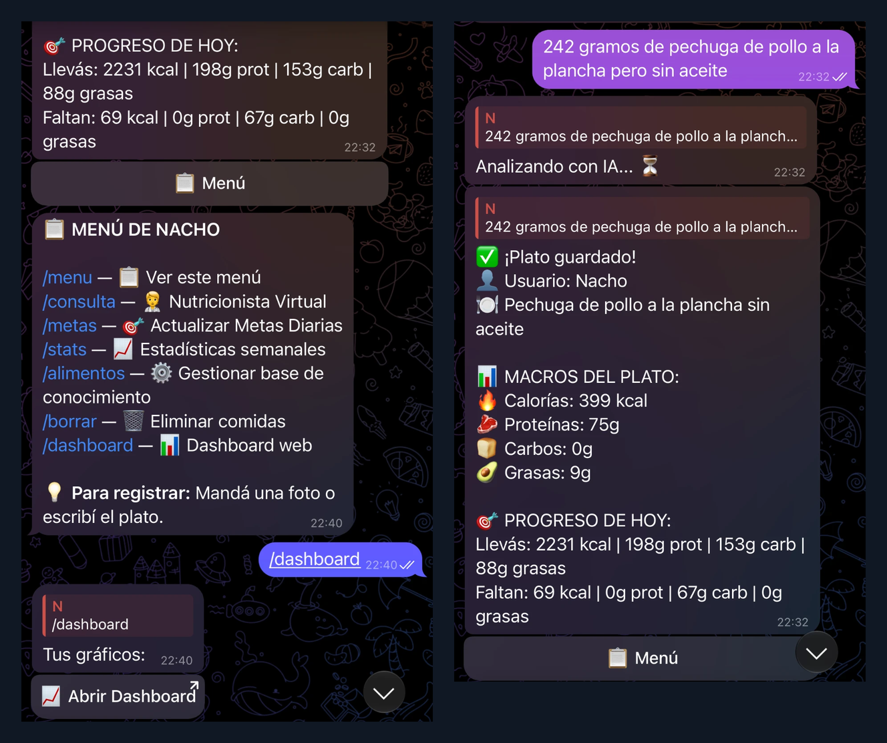
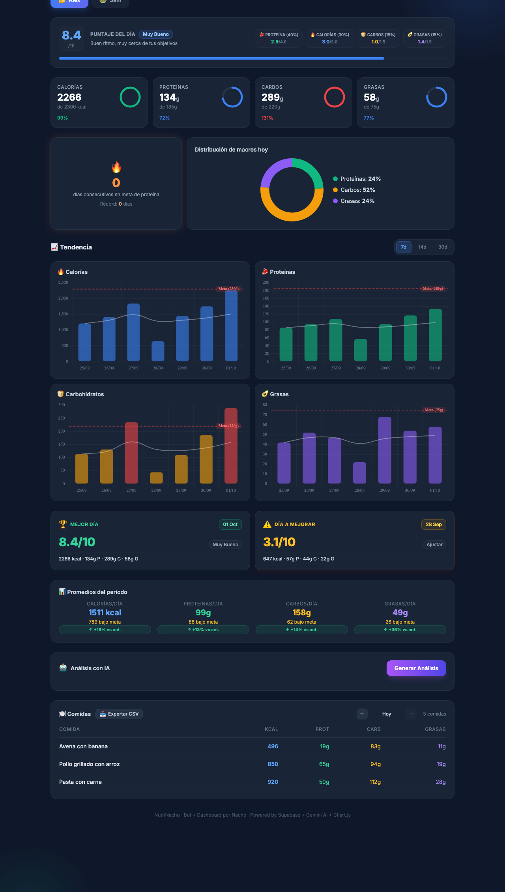
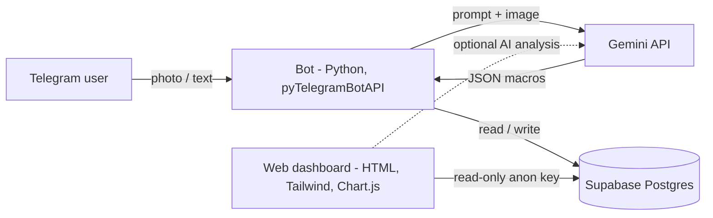

# NutriNacho

[](https://github.com/Ignacio-Durich/NutriNacho/actions/workflows/ci.yml)

A private nutrition tracker I built for myself and my mom. Send a photo or a short description of a meal to a **Telegram bot**; **Gemini** estimates calories and macros, the result is stored in **Supabase**, and a **web dashboard** shows daily progress, trends and AI-written analysis.

It runs 24/7 on a small cloud VM and is used every day by two real people, each with their own goals.

<p align="center">
  
</p>

<p align="center">
  
</p>

> The dashboard screenshot uses invented demo data (users "Alex" and "Sam").

## What it does

- **Log meals by photo or text.** Gemini returns structured JSON (name, kcal, protein, carbs, fat) that is saved per user.
- **Skips the AI when it can.** Foods you saved before are matched from your own table first, which is faster and cheaper.
- **Corrections in plain language.** "Make it 300 g instead" edits the last entry, with simple fixes handled by rules and the rest by the model.
- **Per-user goals.** Each person sets their own daily targets with a guided `/metas` flow. Every goal change is stored as a new row, so the history is kept.
- **Virtual nutritionist.** `/consulta` answers questions using your recent intake (for example, what to eat for dinner given what is left today).
- **Model fallback.** If a Gemini model hits its rate limit, the bot retries down a chain of models instead of failing.
- **Dashboard.** Daily score out of 10, macro rings, 7/14/30-day trends with goal lines, best and worst day, period averages, protein streak, meal list, CSV export, and on-demand AI analysis. Installable as a PWA.

| Command | Purpose |
|---|---|
| photo / text | Log a meal |
| `/metas` | Update daily goals |
| `/stats` | Weekly averages |
| `/consulta` | Ask the virtual nutritionist |
| `/alimentos` | Manage the saved-foods table |
| `/borrar` | Delete logged meals |
| `/dashboard` | Open the web dashboard |
| `/menu` | Show the menu |

## Architecture



- **Bot:** a single Python file, [`bot/nutribot.py`](bot/nutribot.py), running under `tmux` on a Google Cloud VM. It uses a server-side Supabase secret key.
- **Dashboard:** a static page ([`dashboard/`](dashboard)) with no build step, hosted on Netlify. It only reads data.
- **Database:** three tables, `comidas` (meals), `metas` (goal history) and `alimentos_frecuentes` (saved foods).
- **Days end at 04:00 UTC** (UTC-4), so late-night meals count toward the day they belong to. The bot and the dashboard share this rule.

## Run it yourself

You need a Telegram bot token ([@BotFather](https://t.me/BotFather)), a [Gemini API key](https://aistudio.google.com/apikey) and a [Supabase](https://supabase.com) project.

### 1. Database

Create the tables in Supabase:

| Table | Columns |
|---|---|
| `comidas` | `id`, `comida` text, `calorias` int, `proteina_g` int, `carbohidratos_g` int, `grasas_g` int, `fecha` timestamp, `usuario_id` bigint, `meta_id` bigint → `metas.id` |
| `metas` | `id`, `fecha_creacion` timestamptz, `calorias`, `proteina_g`, `carbohidratos_g`, `grasas_g`, `usuario_id` bigint |
| `alimentos_frecuentes` | `id`, `nombre` text, `porcion` text, `calorias`, `proteina_g`, `carbohidratos_g`, `grasas_g` |

Enable RLS on all three. The bot uses the secret key, which bypasses RLS. For the dashboard see [Security notes](#security-notes).

### 2. Bot

```bash
git clone https://github.com/Ignacio-Durich/NutriNacho.git
cd NutriNacho
python3 -m venv .venv && source .venv/bin/activate
pip install -r requirements.txt

cp .env.example .env                           # fill in your keys
cp bot/users.example.json bot/users.json       # your Telegram user IDs and goals

python bot/nutribot.py
```

`bot/users.json` is the allow-list: only the Telegram IDs listed there can use the bot. To find your ID, message [@userinfobot](https://t.me/userinfobot).

### 3. Dashboard

```bash
cp dashboard/config.example.js dashboard/config.js   # Supabase URL, anon key, users
cd dashboard && python3 -m http.server 8080
```

Without `config.js` the page loads with placeholder values and no data. To deploy, upload the `dashboard/` folder (including your `config.js`) to any static host.

### 4. Tests

```bash
node tests/e2e_runner.js
```

Needs Node.js only, no dependencies. The suite runs the dashboard in a small DOM harness with mocked Supabase, Chart.js and service worker.

## Security notes

- Secrets live in `.env`, Telegram IDs and goals in `bot/users.json`, and dashboard settings in `dashboard/config.js`. All three are git-ignored.
- The Supabase **secret** key is used only by the bot. The dashboard uses the **anon** key, which is visible to anyone who opens the page.
- **Heads up:** my `comidas` table has a "public read" policy so the dashboard can work without logins. Anyone with the dashboard URL and anon key can read all meals. If you track real data, add authentication (Supabase Auth plus per-user RLS policies) or keep the dashboard private. I do not link my deployed dashboard from this repo for that reason.
- The optional AI analysis in the dashboard calls Gemini from the browser. Use a separate key restricted by HTTP referrer, never the bot's key.

## Known limitations and roadmap

- **Tests:** 110 dashboard tests (`node tests/e2e_runner.js`) and 76 bot tests (`pytest`, offline, no keys needed). GitHub Actions runs both, plus a scan for committed secrets, on every push and pull request.
- The VM runs Python 3.9, which Google libraries now flag as end-of-life. Upgrade to 3.10+.
- Deployment is manual (upload file, restart in `tmux`). A `git pull` or CI-based deploy would be better (CI currently only runs the tests).
- The bot and dashboard text is in Spanish. Internationalization is not done.
- No authentication on the dashboard (see above).
- Calorie and macro values are model estimates, not nutritional advice.

## Tech stack

Python · pyTelegramBotAPI · Google Gemini (google-genai SDK) · Supabase (Postgres) · HTML, Tailwind CSS, Chart.js · Netlify · Google Compute Engine · Node.js (tests)

## License

[MIT](LICENSE) © 2026 Ignacio Durich
